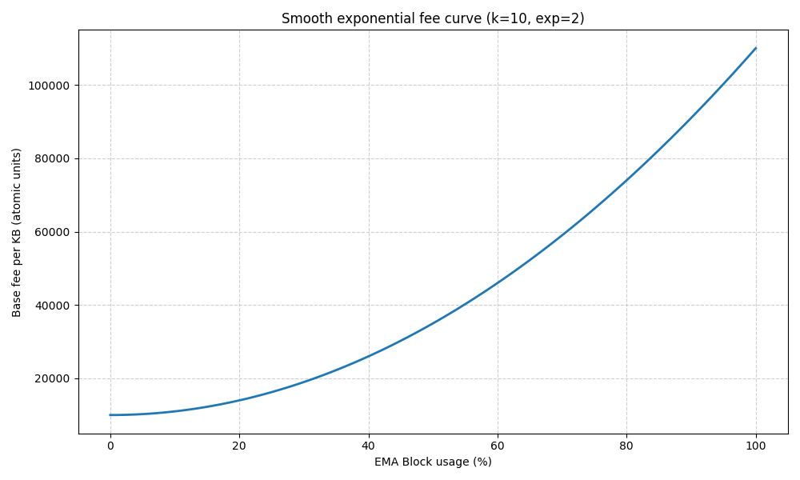
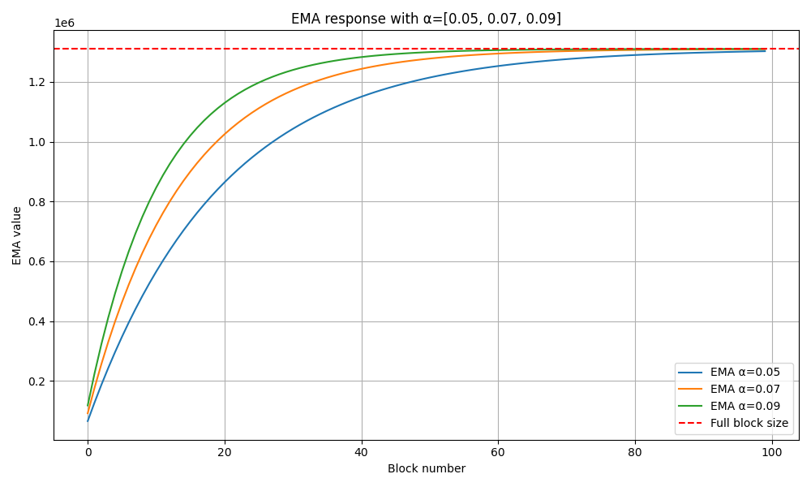

# XELIS Simulator

This repository contains various program for simulating part of XELIS chain.

Before using any scripts available, make sure to have Python and Poetry installed.
Then, you need to have the dependencies installed: `poetry install`

## Difficulty

In the `difficulty` folder, there is two distincts program parts:
- one is to generate random data (`generate.py`)
- the other is to visualize it using Matplotlib (`graph.py`).

This program allows to visualize the reaction of the Kalman Filter used as a difficulty adjustment algorithm
by estimating the unknown network hashrate.

### Usage

Then, you can generate data to visualize it.
`poetry run generate.py`

Now that you have a CSV file created (named `attempts.csv`) you can run the following command:
`poetry run graph.py`

## Dynamic Fee

In the `dynamic_fee` folder, we have two distinct parts again:
- `base_fee.py` which allows to visualize how the dynamic base fee (fee per kB) will react against the block usage %.
- `block_size_ema.py` to visualize the reaction from spikes of big blocks against the EMA.

